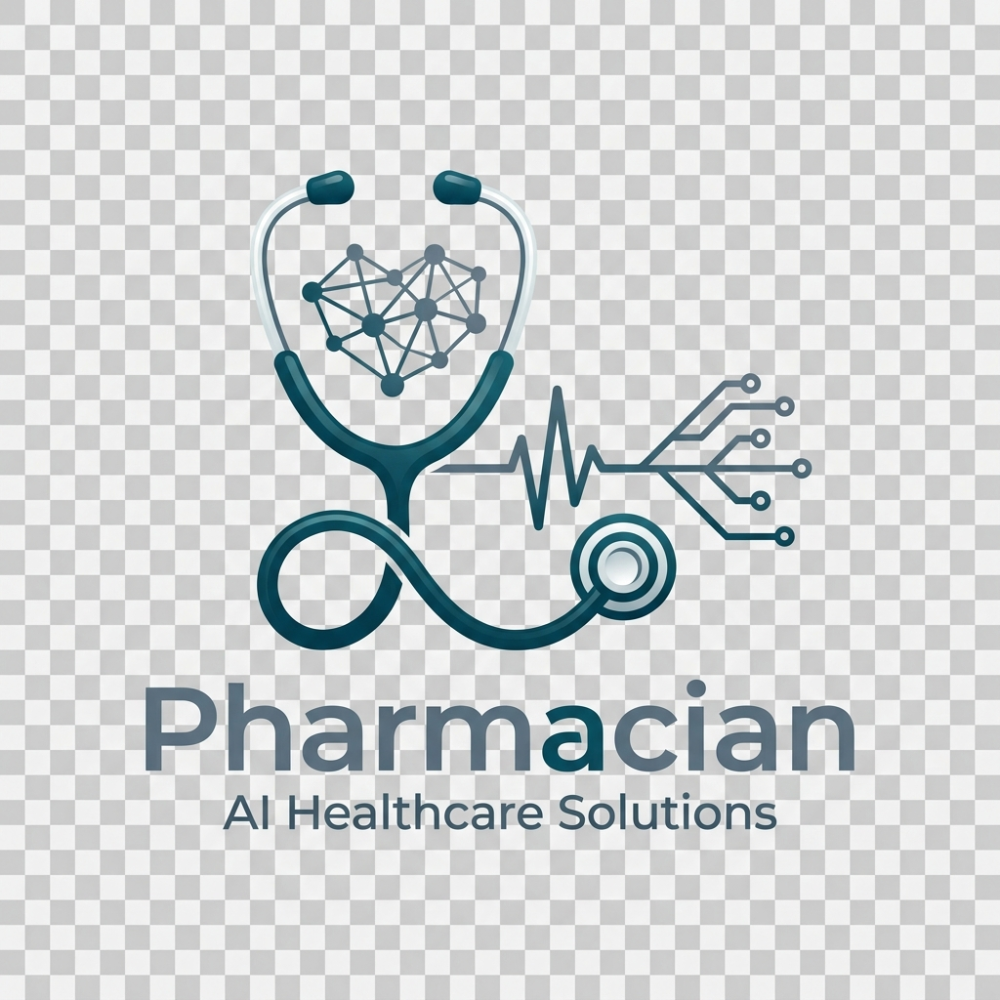
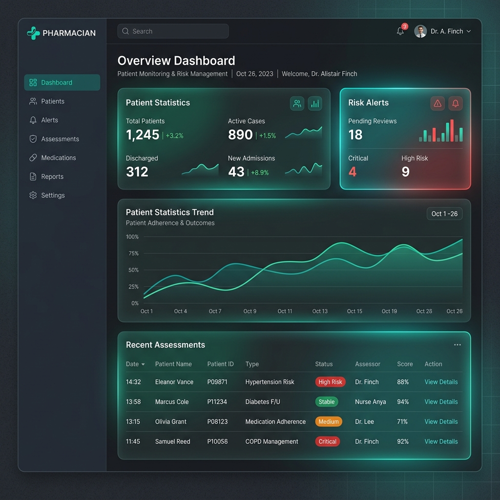

<p align="center">
  
</p>

# 🩺 Pharmacian | Clinical-Grade Disease Risk Assessment

<p align="center">
  
  
  
  
</p>

### **Empowering Clinicians with Transparent, Data-Driven Insights**

Pharmacian is a high-performance clinical diagnostic platform that bridges the gap between raw medical data and clinical confidence. By combining an **Ensemble of Machine Learning Algorithms** with **Explainable AI (XAI)**, Pharmacian provides healthcare professionals with not just predictions, but the clinical rationale behind them.

---

## 📸 Visual Overview

<p align="center">
  
  <br>
  <i>Figure 1: Pharmacian Clinical Dashboard - Designed for modern, high-stakes environments.</i>
</p>

---

## ⚡ Core Value Propositions

| 🧠 **Explainable AI (XAI)** | 🔒 **Privacy First** | 🧪 **Ensemble Consensus** |
| :--- | :--- | :--- |
| Never guess "why". Pharmacian reveals the clinical drivers and matched symptoms for every assessment. | All patient data remains **local-only**. No cloud dependency, ensuring maximum HIPAA-ready privacy. | High-confidence diagnostics through the agreement of Random Forest, Decision Tree, and Naive Bayes models. |

---

## 🛠️ Technology Stack

Pharmacian is built with a robust, hybrid architecture designed for portability and performance.

*   **Frontend Shell**: [Electron v31](https://www.electronjs.org/) - Native desktop experience with offline reliability.
*   **UI Engine**: Vanilla JS (ES6+) with a custom CSS Glassmorphism design system.
*   **Backend Intelligence**: [Python 3.13](https://www.python.org/) + [Flask](https://flask.palletsprojects.com/) Micro-service.
*   **Machine Learning**: [Scikit-Learn](https://scikit-learn.org/) (Random Forest, Decision Tree, GaussianNB).
*   **Safety Integration**: [OpenFDA API](https://open.fda.gov/) for real-time drug-drug interaction checking.
*   **Local Storage**: [SQLite3](https://www.sqlite.org/) via `better-sqlite3` for high-speed, local-first patient records.

---

## 🚀 Installation & Launch

### Prerequisites
- **Node.js 16+** & **Python 3.10+** installed on your Windows machine.

### Quick Start
1. **Clone the Repository**
   ```bash
   git clone https://github.com/DarkSlayers/Pharmacian-monitoring.git
   cd Pharmacian-monitoring
   ```
2. **Launch with Auto-Setup**
   Our smart launcher handles all Node and Python dependencies for you:
   ```powershell
   # In PowerShell
   .\run_app.ps1
   ```
   *Alternatively, use `run_app.cmd` for Command Prompt.*

---

## 🚩 Key Features

- ✅ **Multi-Disease Risk Engine**: Real-time assessment across dozens of pathologies.
- ✅ **Multilingual Support**: Input symptoms in **English, Hindi, or Marathi**.
- ✅ **FDA Safety Shield**: Instant verification of medication interactions via OpenFDA.
- ✅ **Smart Refinement**: AI-driven follow-up questions to disambiguate complex cases.
- ✅ **Clinical Export**: Generate professional PDF reports for patient records.
- ✅ **Visual Analytics**: Interactive risk-factor dashboards and longitudinal history.

---

## ⚖️ License & Disclaimer

**Disclaimer**: Pharmacian is a **prototype demonstration system**. It is NOT approved for medical diagnosis or treatment. Always consult a qualified professional.

Licensed under the [MIT License](LICENSE).

---

<p align="center">
  <b>Built with ❤️ by Team DarkSlayers for the Hackathon 2026</b>
</p>
