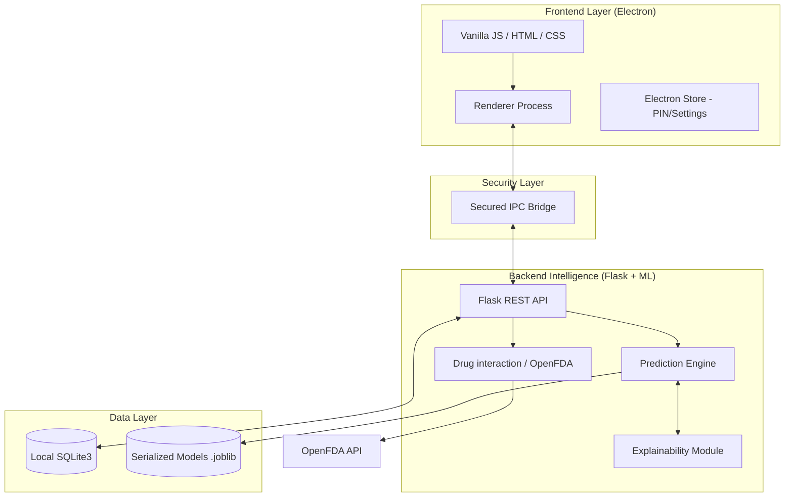

# 🧑‍⚖️ Pharmacian: Judge's Clinical Technical Dossier

## 📋 Executive Summary
**Pharmacian** is a clinical-grade disease risk assessment platform designed to eliminate the "black-box" nature of modern AI in healthcare. By leveraging a **Multi-Model Ensemble** and **Explainable AI (XAI)**, it provides clinicians with high-confidence diagnostics backed by transparent clinical rationale and real-time FDA safety validation.

---

## 🏗️ Technical Architecture

Pharmacian uses a **Hybrid Desktop Architecture** to ensure reliability, security, and offline operation in clinical settings.

---

## 📁 Detailed Project Directory Map

Understanding the structure and specific roles of every component in the Pharmacian ecosystem.

### **1. 🏗️ Root Configuration & Launchers**
The core handles environment setup, dependencies, and application orchestration.

| File / Folder | Technical Role & Usage |
| :--- | :--- |
| **`run_app.ps1`** | **Primary Launcher (PowerShell)**: Checks Node/Python, installs deps, and starts the app. |
| **`run_app.cmd`** | **Windows Command Launcher**: Legacy support for non-PowerShell environments. |
| **`package.json`** | **Node.js Manifest**: Defines Electron version, build scripts, and dependencies. |
| **`docs/`** | **Documentation Assets**: Contains project logos, mockups, and visual guides. |

### **2. 🧠 Backend Module (`/backend`)**
The "Clinical Brain" where AI inference, data logic, and safety verification occurs.

| File / Folder | Technical Role & Usage |
| :--- | :--- |
| **`prediction_engine.py`** | **The ML Core**: Orchestrates Random Forest, Decision Tree, and Naive Bayes inference. |
| **`api_endpoints.py`** | **REST API**: Flask-driven routes for assessments, interactions, and results. |
| **`medical_kb_config.py`** | **Knowledge Base**: Stores clinical rationale, disease panels, and research databases. |
| **`drug_interaction.py`** | **FDA Shield**: Logic for querying OpenFDA and normalizing medication safety data. |
| **`reinforcement_engine.py`** | **Feedback Logic**: Handles diagnostic corrections and model refinement signals. |
| **`/data`** | **Training Data**: Historical datasets used for model training and validation. |

### **3. 🐚 Electron Shell (`/electron`)**
The secure wrapper that bridges the desktop environment with the Python backend.

| File / Folder | Technical Role & Usage |
| :--- | :--- |
| **`desktop_main.js`** | **Main Process**: Manages window lifecycles, backend spawning, and app events. |
| **`ipc_handlers.js`** | **IPC Communication**: Securely maps frontend requests to backend API calls. |
| **`database.js`** | **Storage Manager**: Direct interface for the local SQLite3 clinical database. |
| **`electron_bridge.js`** | **Preload Script**: Secure process sandboxing and API exposing for the UI. |

### **4. 🎨 Frontend UI (`/frontend`)**
The clinical interface designed for high-stakes decision support.

| File / Folder | Technical Role & Usage |
| :--- | :--- |
| **`/templates`** | **HTML Views**: High-performance dashboard, assessment, and result screens. |
| **`app.js`** | **State Management**: Orchestrates the UI lifecycle and real-time form data. |
| **`style.css"** | **Design System**: Global clinical-grade CSS with full light/dark mode support. |
| **`symptom_nlp.js"** | **NLP Parser**: Client-side parsing and auto-suggest for symptom keywords. |
| **`pdf_report.js"** | **Report Engine**: Client-side generation of professional clinical PDFs. |

---

## 🔬 Core Technical Innovations

### 1. The Ensemble Consensus Engine
Unlike single-model systems, Pharmacian utilizes three distinct algorithms to reach a diagnostic consensus:
-   **Random Forest (100 Estimators)**: Captures complex, non-linear symptom correlations.
-   **Decision Tree**: Provides clear, deterministic decision paths for high-impact symptoms.
-   **Gaussian Naive Bayes**: Offers fast, probabilistic reasoning for symptom combinations.

**Consensus Logic**: A "Consensus Score" (e.g., 3/3) is calculated. If models diverge, the system triggers a **Low Confidence** warning and suggests further clinical review.

### 2. Clinical Explainability (XAI)
We believe results without reasons are dangerous. Pharmacian implements two layers of explainability:
-   **Feature Extraction (Matched Symptoms)**: The system extracts and displays the top 5 clinical markers that most contributed to the active prediction.
-   **Dynamic Refinement Divergence**: If model confidence is low (<60%), the engine calculates the **Feature Divergence** between the top two diseases and automatically generates 3 follow-up questions to disambiguate the diagnosis.

### 3. Patient Privacy & Security
-   **Local-First Storage**: 100% of patient records are stored locally via `better-sqlite3`. No clinical data is transmitted over the cloud.
-   **Process Isolation**: The Electron-Flask bridge is secured via validated IPC, preventing cross-site scripting (XSS) from accessing the medical engine.
-   **HIPAA Compliance Path**: By maintaining zero-cloud footprint, Pharmacian sidesteps many data-in-transit vulnerabilities common in web-only solutions.

---

## 📊 Performance & Scalability

| Metric | Measurement |
| :--- | :--- |
| **Inference Latency** | 200ms - 450ms (Ensemble Voting) |
| **RAM Footprint** | ~250MB (Electron + Flask + 3 ML Models) |
| **Model Size** | < 100MB Total |
| **Database Speed** | < 5ms (Query per patient history) |

---

## 🧪 Multilingual & Hybrid Input
Pharmacian supports a unique **Symptom Translation Layer**:
-   **English, Hindi, and Marathi** support via a dictionary-based translation engine.
-   **Hybrid Features**: The ML models ingest both **Symptom Text** (extracted via tokenization) and **Structural Profile Data** (Age, Weight, Medical History) to ensure the clinical context is fully captured.

---

## 🛠️ Advanced Judge FAQ

**Q: How do you handle class imbalance in small training datasets?**  
A: We use stratified 80:20 splitting and class-weighted loss functions. In production, we'd augment this with SMOTE (Synthetic Minority Over-sampling Technique).

**Q: Isn't Flask too slow for a high-performance desktop app?**  
A: Flask is used only as a lightweight orchestrator for the C-accelerated Scikit-Learn predictions. The "real work" happens in the Scikit-learn backend, which is extremely efficient.

**Q: What happens if the OpenFDA API is down?**  
A: The system enters a graceful "Offline Guard" mode. It warns the clinician that live drug interaction checking is unavailable and prioritizes local history review.

---

## 🛣️ Future Roadmap: Clinical Scale-Out
1. **EHR/FHIR Integration**: Exporting assessments to standard hospital records.
2. **Federated Learning**: Retraining models on new clinical cohorts without sharing raw patient data.
3. **Advanced NLP**: Moving from keyword-matching to Transformer-based clinical note extraction.
4. **Advanced ML Models**: Which Providing the medications name and dosage over the symptoms to the physicians
5. **Role based access control**: which provides seprate panel for physician and pharmacist.

---

  <b>Pharmacian - The Future of Clear Clinical Diagnostics.</b>

